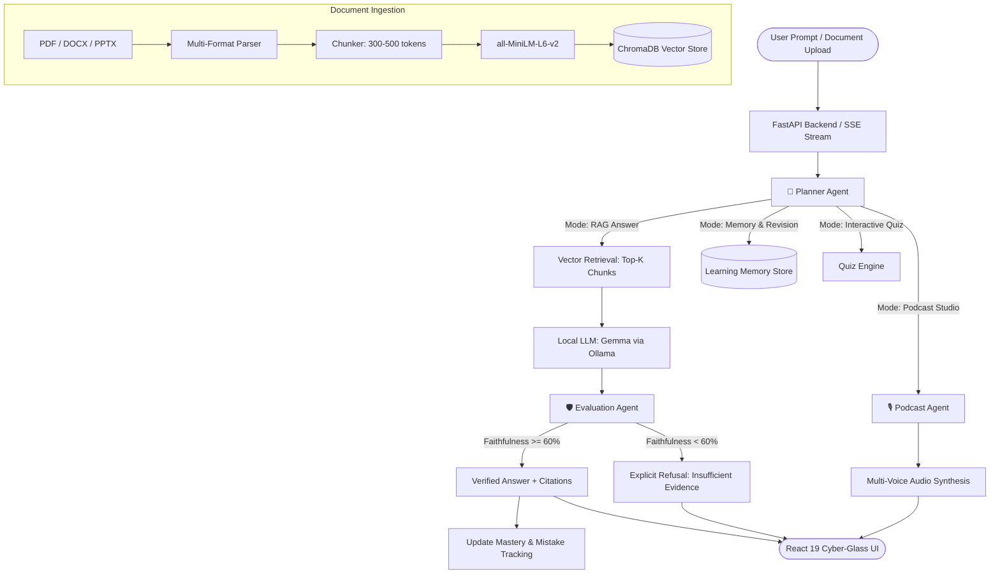

# 🎓 MentorOS

> **A local, privacy-first Autonomous AI Learning Copilot & Educational Operating System.**  
> Built for students and researchers to turn lecture slides, research papers, and textbooks into grounded answers, interactive quizzes, long-term mastery insights, and two-voice educational podcasts.

---

[](https://fastapi.tiangolo.com)
[](https://react.dev)
[](https://vitejs.dev)
[](https://ollama.com)
[](https://www.trychroma.com)
[](LICENSE)

---

## 🌟 Key Highlights

- **🔒 100% Local & Privacy-Preserving**: Runs completely offline on local consumer hardware (optimized for RTX 40-series 6GB VRAM or CPU) via Ollama. No subscription, no cloud leaks.
- **🛡️ Anti-Hallucination Gatekeeper**: Every generated answer is scored by an autonomous **Evaluation Agent** for faithfulness against retrieved source context before it reaches the UI.
- **🎙️ Two-Voice Podcast Studio**: Transforms any document into an engaging, multi-turn educational dialogue between an enthusiastic tutor and a curious student, synthesized into dual-voice audio.
- **🧠 Continuous Learning Memory**: Tracks topics, misconception counts, and confidence scores across sessions to generate personalized study plans and reflection summaries.
- **🔍 Explainable AI (XAI)**: Visualizes the pipeline execution timeline in real-time — query routing, vector search retrieval, and confidence scoring with source page citations.

---

## 🏗️ Architecture & Agent Pipeline

MentorOS orchestrates multi-agent decision loops alongside dense vector retrieval and structured memory:



---

## ✨ Features

### 1. Document RAG & Grounded Q&A
- Multi-format ingestion: `.pdf`, `.docx`, `.pptx`.
- Context-aware retrieval powered by `sentence-transformers/all-MiniLM-L6-v2`.
- Accurate citations linking responses directly to original file names and page/slide numbers.

### 2. Multi-Agent Routing System
- **Planner Agent**: Classifies incoming queries into `RETRIEVE`, `MEMORY`, `QUIZ`, or `PODCAST` modes.
- **Evaluation Agent**: Evaluates semantic alignment and factual faithfulness. Refuses to hallucinate answers not supported by uploaded course material.
- **Podcast Agent**: Converts complex source chapters into dynamic two-host podcast scripts and stitches speech synthesis audio.

### 3. Dedicated Podcast Studio
- Adjustable conversation length (from quick 4-turn recaps up to in-depth 30-turn deep dives).
- Dual-speaker transcript viewer (Host / Student roles).
- Built-in audio player with scrubbing, speed control, and download options.

### 4. Learning Memory & Self-Reflection
- Topic-level confidence tracking with mastery decay.
- One-click **Learning Reflection** summarization diagnosing weak areas and recommending revision targets.

### 5. High-Performance Modern Interface
- Real-time token streaming using Server-Sent Events (SSE).
- Built with React 19, Tailwind CSS, Framer Motion, Lucide icons, and Three.js visuals.

---

## 🛠️ Tech Stack

| Layer | Technology |
| :--- | :--- |
| **Frontend** | React 19, Vite, Tailwind CSS, Framer Motion, Zustand, Lucide-react, Three.js |
| **Backend** | FastAPI, Uvicorn, SSE-Starlette, SQLite |
| **Local LLM** | Ollama (`gemma3:4b` / `gemma4:e2b` / `gemma:2b`) |
| **Vector DB** | ChromaDB |
| **Embeddings** | HuggingFace `sentence-transformers/all-MiniLM-L6-v2` |
| **Document Parsers** | `pypdf`, `python-docx`, `python-pptx` |
| **Audio / TTS** | Edge-TTS / Piper dual-voice synthesizer |

---

## 🚀 Quickstart Guide

### Prerequisites
1. **Python 3.10+** installed.
2. **Node.js 18+** & `npm` installed.
3. **Ollama** installed from [ollama.com](https://ollama.com).

---

### Step 1: Set Up & Launch Ollama
1. Open a terminal and pull your preferred local model:
   ```bash
   ollama pull gemma3:4b
   ```
   *(For low VRAM systems or lightweight testing, `ollama pull gemma:2b` or `gemma4:e2b` works smoothly).*
2. Ensure Ollama service is running:
   ```bash
   ollama serve
   ```

---

### Step 2: Set Up Backend (FastAPI)
1. In the project root, create and activate a Python virtual environment:
   ```bash
   # Windows PowerShell
   python -m venv venv
   .\venv\Scripts\Activate.ps1

   # Linux / macOS
   python3 -m venv venv
   source venv/bin/activate
   ```
2. Install Python dependencies:
   ```bash
   pip install -r requirements.txt
   ```
3. Start the MentorOS API server:
   ```bash
   python run_api.py
   ```
   The backend will start at: `http://localhost:8000`  
   Interactive API Docs: `http://localhost:8000/docs`

---

### Step 3: Set Up Frontend (React + Vite)
1. Open a second terminal and navigate to `frontend`:
   ```bash
   cd frontend
   npm install
   ```
2. Start the Vite development server:
   ```bash
   npm run dev
   ```
3. Open your browser and navigate to `http://localhost:5173`.

---

## 📁 Project Structure

```plaintext
MentorOS/
├── agents/                     # Autonomous agents
│   ├── planner_agent.py        # Intent classification & task routing
│   ├── evaluation_agent.py     # Hallucination gating & confidence scoring
│   └── podcast_agent.py        # Dialogue generation & audio synthesis
├── api/                        # FastAPI backend application
│   ├── routers/                # Endpoint routers (chat, files, podcast, memory)
│   ├── services/               # Orchestrator & background worker services
│   ├── database.py             # SQLite persistence for sessions & memory
│   └── main.py                 # FastAPI application factory
├── chroma_db/                  # Local vector database storage
├── data/
│   ├── podcasts/               # Generated podcast scripts & audio files
│   └── uploads/                # User-uploaded course documents
├── embeddings/                 # Sentence-transformers wrapper & vector store
├── frontend/                   # React 19 + Vite frontend
│   ├── src/
│   │   ├── components/         # UI components (chat, audio player, sidebar)
│   │   ├── pages/              # ChatPage, PodcastPage, SettingsPage
│   │   ├── api/                # API client & SSE streaming parser
│   │   └── useChatStore.js     # State management store
│   └── vite.config.js          # Vite config & API reverse proxy
├── ingestion/                  # Document parsing and chunking
│   ├── parser.py               # PDF, DOCX, and PPTX parsers
│   └── chunker.py              # Semantic text chunking with overlap
├── llm/                        # Ollama client and prompt templates
├── memory/                     # Learning memory & reflection generator
│   ├── memory_store.py         # Topic mastery & misconception tracker
│   └── reflection_generator.py # Session synthesis & revision planner
├── requirements.txt            # Python dependencies
├── run_api.py                  # API server startup script
└── README.md                   # Project documentation
```

---

## 📡 API Overview

| Method | Endpoint | Description |
| :--- | :--- | :--- |
| `POST` | `/api/upload` | Upload & ingest study materials (`.pdf`, `.docx`, `.pptx`) |
| `GET` | `/api/files` | List currently indexed documents in vector store |
| `POST` | `/api/chat` | Send prompt with real-time SSE stream response |
| `POST` | `/api/podcast/generate` | Generate podcast script & dual-voice MP3 from topic/doc |
| `GET` | `/api/podcast/audio/{filename}` | Stream synthesized podcast audio |
| `GET` | `/api/memory/topics` | Get mastery and weakness metrics across topics |
| `GET` | `/api/reflection` | Generate dynamic revision plan and reflection summary |
| `GET` | `/api/status` | Health check & Ollama connectivity status |

---

## ⚙️ Configuration & Environment

Configuration settings can be adjusted in `api/config.py` or through environment variables:

| Variable | Default | Description |
| :--- | :--- | :--- |
| `OLLAMA_BASE_URL` | `http://localhost:11434` | Ollama service endpoint |
| `OLLAMA_MODEL` | `gemma3:4b` | Active local LLM model name |
| `EMBEDDING_MODEL` | `all-MiniLM-L6-v2` | Sentence-transformer embedding model |
| `MAX_UPLOAD_SIZE_MB` | `500` | Maximum single-file upload size (0 = unlimited) |
| `HALLUCINATION_THRESHOLD` | `0.60` | Minimum confidence score required to approve answers |

---

## 🤝 Contributing

Contributions are welcome! Please follow these steps:
1. Fork the repository.
2. Create your feature branch (`git checkout -b feature/awesome-feature`).
3. Commit your changes (`git commit -m 'Add some awesome feature'`).
4. Push to the branch (`git push origin feature/awesome-feature`).
5. Open a Pull Request.

---

## 📄 License

Distributed under the **MIT License**. See `LICENSE` for more information.
